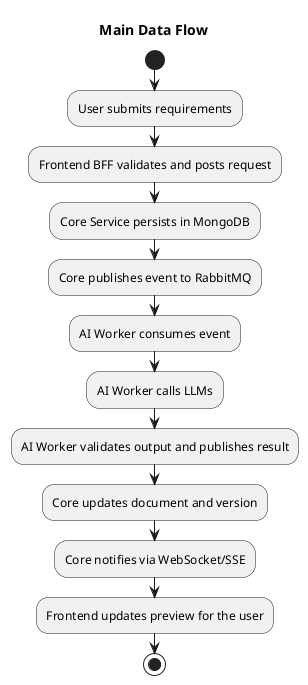
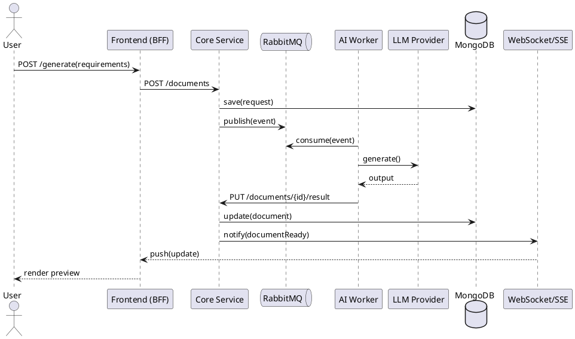
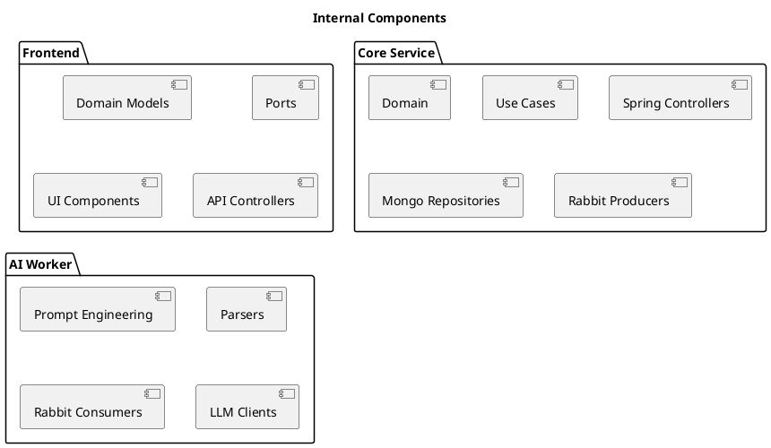

# DocGen AI — Technical Specification & Implementation Plan

Version: `v1.0.0`  |  Date: `2025-12-11`  |  Status: `In progress`

## Table of Contents
- [Overview](#overview)
- [Goals](#goals)
- [Scope](#scope)
- [Repository Structure](#repository-structure)
- [System Architecture](#system-architecture)
- [Security & BFF](#security--bff)
- [Asynchronous Processing](#asynchronous-processing)
- [Requirements](#requirements)
- [Prerequisites & Dependencies](#prerequisites--dependencies)
- [Infrastructure (Docker)](#infrastructure-docker)
- [Workflows](#workflows)
- [Use Cases](#use-cases)
- [APIs & Examples](#apis--examples)
- [Quality & Testing](#quality--testing)
- [Observability](#observability)
- [DevOps Pipeline](#devops-pipeline)
- [UML Diagrams](#uml-diagrams)
- [Versioning & History](#versioning--history)
- [References](#references)

## Overview
DocGen AI is a SaaS platform that orchestrates `LLMs` to transform requirements into structured, multilingual technical documentation with editable diagrams (`Mermaid.js` and `PlantUML`). The project adheres to Hexagonal Architecture (Ports & Adapters) with a `BFF` built in `Next.js` acting as a security and orchestration layer.

## Goals
- Generate versioned technical documents from functional and non-functional requirements.
- Enable human review of generated content (“human-in-the-loop”).
- Support editing and rendering of diagrams.
- Avoid HTTP timeouts using asynchronous processing via a message queue.

## Scope
- Frontend (`Next.js`) acting as `BFF` and UI.
- `Core Service` (Java) implementing business rules and persistence.
- `AI Worker` (Java) integrating with `LLM` providers.
- Infrastructure: `MongoDB`, `Redis`, `RabbitMQ`, `Keycloak`.

## Repository Structure
Monorepo at the root directory `/`.

```bash
.
├── docker/                          # Infrastructure & Orchestration
│   ├── config/                      # Config (Keycloak realms, Prometheus, etc.)
│   ├── docker-compose-infra.yml     # Databases, Broker, Keycloak
│   └── docker-compose-apps.yml      # Frontend and Backend applications
│
├── frontend/                        # Next.js (BFF + UI)
│   ├── public/
│   ├── src/
│   │   ├── domain/                  # Pure JS/TS logic (Entities, Validation, Use Cases)
│   │   │   ├── models/              # e.g., Requirement.ts, Document.ts
│   │   │   └── ports/               # Interfaces (e.g., AuthRepository, DocRepository)
│   │   ├── adapters/                # Infrastructure implementations
│   │   │   ├── ui/                  # React components (client side)
│   │   │   └── api/                 # Next.js API routes (BFF side)
│   │   │       ├── controllers/     # Route handlers
│   │   │       └── gateways/        # HTTP clients to Java microservices
│   │   └── app/                     # Next.js App Router
│   ├── Dockerfile
│   └── package.json
│
├── backend/                         # Java microservices
│   ├── doc-core-service/            # Core domain
│   │   ├── src/main/java/com/docgen/core/
│   │   │   ├── domain/              # Entities, Use Cases, Ports (no framework dependencies)
│   │   │   ├── application/         # Service orchestrators
│   │   │   └── infrastructure/      # Adapters (Spring Controllers, Mongo Repos, Rabbit Producers)
│   │   ├── Dockerfile
│   │   └── pom.xml
│   │
│   └── ai-worker-service/           # AI processing & integration
│       ├── src/main/java/com/docgen/worker/
│       │   ├── domain/              # Prompt engineering, Parsers
│       │   └── infrastructure/      # Adapters (Rabbit Consumers, Spring AI Clients)
│       ├── Dockerfile
│       └── pom.xml
│
└── docs/                            # Project documentation & architecture diagrams
```

## System Architecture
- Global pattern: Hexagonal Architecture (`Ports & Adapters`).
- Strict separation between domain and technology (no `Spring` in `domain`, no `React` hooks in business logic).
- Asynchronous communication via `RabbitMQ` between `Core` and `AI Worker`.
- Authentication and authorization handled by `Keycloak` (OAuth2 Code Flow).

### Main Components
- `Frontend (BFF)`: authenticates users, validates and formats inputs, aggregates responses; no business rules.
- `Core Service`: use cases, persistence (`MongoDB`), event publication (`RabbitMQ`).
- `AI Worker`: event consumption, calls to `LLMs`, validation, and result delivery.
- `Redis`: optional cache for performance.
- `Keycloak`: identity provider.

## Security & BFF
- `BFF` acts as a security shield.
- Token handling: store `Access/Refresh Tokens` server-side (or encrypted HTTP-only cookies).
- Never expose `JWT` to client-side code.
- Input validation with `Zod` in the `BFF` (sanitization and schema validation).

## Asynchronous Processing
- Rationale: `LLM` generation is slow (10–60s); avoid HTTP timeouts.
- Flow: `BFF` triggers event → `Core` persists → `Queue` → `Worker` processes → notification via `WebSocket/SSE`.

## Requirements
### Functional
- Project management: create/edit projects with metadata (language, stack).
- Requirements editor: rich text for functional and non-functional requirements.
- Generation engine: orchestrates `LLMs` for text and diagrams (`Mermaid.js`).
- Live preview: split-screen (Markdown/Code vs. Rendered view).
- Interactive refinement: section-level comments trigger partial regeneration.
- Versioning: full history with diff comparison.
- Export: `Markdown`, `PDF`, and `HTML`.

### Non-Functional
- Reliability and output consistency from `LLMs`.
- Performance: controlled median and `P95` latency; no backpressure.
- Security: OAuth2, secure token storage.
- Observability: metrics, structured logs, tracing.

## Prerequisites & Dependencies
- `Node.js` 20+ and `npm`/`pnpm`.
- `Java` 21+ (`JDK`).
- `Docker Desktop` and `Docker Compose v2`.
- `Maven` for Java services build.
- `PlantUML` and `Graphviz` for local diagram rendering.
- Access to `LLM` providers and keys (`OPENAI_API_KEY`).

Key environment variables:
- `OPENAI_API_KEY`: key for the LLM provider.
- `KEYCLOAK_CLIENT_SECRET`: secret for `docgen-web` client.
- `KEYCLOAK_ISSUER`: realm issuer (e.g., `http://keycloak:8080/realms/DocGenRealm`).
- `BACKEND_API_URL`: base for `Core` (e.g., `http://doc-core-service:8080`).

## Infrastructure (Docker)
`docker/docker-compose-infra.yml` — infrastructure services.

```yaml
version: '3.8'
services:
  mongodb:
    image: mongo:latest
    ports: ["27017:27017"]
    volumes: ["mongo_data:/data/db"]

  redis:
    image: redis:alpine
    ports: ["6379:6379"]

  rabbitmq:
    image: rabbitmq:3-management
    ports: ["5672:5672", "15672:15672"]

  postgres-keycloak:
    image: postgres:15
    environment:
      POSTGRES_DB: keycloak
      POSTGRES_USER: keycloak
      POSTGRES_PASSWORD: password
    volumes: ["postgres_keycloak_data:/var/lib/postgresql/data"]

  keycloak:
    image: quay.io/keycloak/keycloak:24.0
    command: start-dev
    environment:
      KC_DB: postgres
      KC_DB_URL: jdbc:postgresql://postgres-keycloak/keycloak
      KC_DB_USERNAME: keycloak
      KC_DB_PASSWORD: password
      KEYCLOAK_ADMIN: admin
      KEYCLOAK_ADMIN_PASSWORD: admin
    ports: ["8080:8080"]
    depends_on:
      - postgres-keycloak

  prometheus:
    image: prom/prometheus:latest
    ports: ["9090:9090"]
    volumes:
      - "prometheus_data:/prometheus"
      - "./config/prometheus.yml:/etc/prometheus/prometheus.yml:ro"

  grafana:
    image: grafana/grafana:latest
    ports: ["3001:3000"]
    depends_on:
      - prometheus
    volumes:
      - "grafana_data:/var/lib/grafana"

  loki:
    image: grafana/loki:latest
    ports: ["3100:3100"]
    volumes:
      - "./config/loki-local-config.yml:/etc/loki/local-config.yaml:ro"

  promtail:
    image: grafana/promtail:latest
    depends_on:
      - loki
    volumes:
      - "./config/promtail-config.yml:/etc/promtail/config.yml:ro"
      - "/var/log:/var/log"
    command: "-config.file=/etc/promtail/config.yml"

volumes:
  mongo_data:
  postgres_keycloak_data:
  prometheus_data:
  grafana_data:
```

`docker/docker-compose-apps.yml` — applications (depends on infra).

```yaml
version: '3.8'
services:
  doc-core-service:
    build: ../backend/doc-core-service
    environment:
      SPRING_DATA_MONGODB_URI: mongodb://mongodb:27017/docgen
      SPRING_RABBITMQ_HOST: rabbitmq
      OAUTH2_ISSUER_URI: http://keycloak:8080/realms/DocGenRealm
    depends_on:
      - mongodb
      - rabbitmq

  ai-worker-service:
    build: ../backend/ai-worker-service
    environment:
      SPRING_RABBITMQ_HOST: rabbitmq
      OPENAI_API_KEY: ${OPENAI_API_KEY}
    depends_on:
      - rabbitmq

  frontend:
    build: ../frontend
    ports: ["3000:3000"]
    environment:
      KEYCLOAK_CLIENT_ID: docgen-web
      KEYCLOAK_CLIENT_SECRET: ${KEYCLOAK_CLIENT_SECRET}
      KEYCLOAK_ISSUER: http://keycloak:8080/realms/DocGenRealm
      BACKEND_API_URL: http://doc-core-service:8080
    depends_on:
      - doc-core-service

networks:
  default:
    name: docgen-network
    external: true
```

### Useful Endpoints
- `Frontend`: `http://localhost:3000`
- `Keycloak`: `http://localhost:8080`
- `RabbitMQ Console`: `http://localhost:15672`

## Workflows
- Project creation: user sets metadata, language and stack → `BFF` validates → `Core` persists.
- Document generation: user submits requirements → `BFF` validates → `Core` creates request and publishes event → `Worker` generates text/diagrams → `Core` updates version → `Frontend` notifies via `SSE`/`WebSocket`.
- Partial refinement: user comments on a section → only that section is regenerated and versioned.
- Export: select format (`Markdown`, `PDF`, `HTML`) and download.

## Use Cases
- Maintain documentation projects.
- Generate full technical documentation from requirements.
- Compare versions with diffs and approve changes.
- Render and edit diagrams.
- Export and share with teams.

## APIs & Examples
### Example — BFF API route to start generation
```typescript
import { z } from 'zod'

const ReqSchema = z.object({
  projectId: z.string().uuid(),
  requirements: z.string().min(10),
  language: z.enum(['pt-BR','en-US'])
})

export async function POST(req: Request) {
  const body = await req.json()
  const parsed = ReqSchema.safeParse(body)
  if (!parsed.success) return new Response('Invalid payload', { status: 400 })

  const res = await fetch(`${process.env.BACKEND_API_URL}/documents`, {
    method: 'POST',
    headers: { 'Content-Type': 'application/json' },
    body: JSON.stringify(parsed.data)
  })

  return new Response(await res.text(), { status: res.status })
}
```

### Example — Domain port (Core)
```java
package com.docgen.core.domain.ports;

public interface DocumentGenerator {
    void requestGeneration(String projectId, String requirements, String language);
}
```

## Quality & Testing
### Strategies
- Unit tests focused on the domain (minimum 80% coverage).
- End-to-end integration: `BFF` ↔ `Core` ↔ `RabbitMQ` ↔ `Worker` ↔ `MongoDB`.
- Performance: measure generation latency (mean and `P95`); ensure `Worker` consumption without backpressure.
- Keycloak load: simulate 1000+ concurrent logins.
- LLM QA: maintain “Golden Prompts/Data” and validate structure (`JSON`/`Markdown`) before saving.
- Verify `Mermaid.js`/`PlantUML` syntax generated for Frontend rendering.
- **Performance & Load Testing**: Apache JMeter scripts to validate throughput, latency (P95), and back-pressure thresholds for document-generation endpoints; baseline 1 000 concurrent users, ramp-up 5 min, 30 min sustained load, auto-scaled worker replicas.  
- **End-to-End Automation**: Playwright test suites covering critical user journeys (login → create project → generate document → refine section → export PDF) executed in CI against a full Docker-compose stack; screenshots, traces and videos attached to every failed run for instant root-cause analysis.

### Tooling
- `JUnit 5` (Java), `Jest` (Node/React).
- `Testcontainers` (Java), `Supertest` (Node).
- `Prometheus`, `Grafana`, `ELK` for metrics and logs.

## Observability
- Structured logs with request correlation.
- Metrics for `LLM` latency, queue health, and processing time.
- Distributed tracing across `BFF/Core/Worker` interactions.

## DevOps Pipeline
| Phase | Description | Tools |
|---|---|---|
| Development | Implement use cases and adapters; local `docker-compose` | Git, IDE, Docker Compose |
| Unit Testing | Domain focus, minimum 80% coverage | JUnit 5, Jest |
| Integration Testing | E2E across services and infra | Testcontainers, Supertest |
| CI/CD | Automated build, tests and deployment | Jenkins, GitHub Actions, GitLab CI |
| Monitoring | Structured logs and performance metrics | Prometheus, Grafana, ELK |

## UML Diagrams
### System Architecture (Components & Integrations)
```plantuml
@startuml
title Overall Architecture

package "Frontend (Next.js BFF)" as FE {
  [UI]
  [API Controllers]
}

package "Core Service (Java)" as CORE {
  [Domain]
  [Application]
  [Infrastructure]
}

package "AI Worker (Java)" as WORKER {
  [Prompt Engine]
  [Parsers]
}

[Keycloak]
[RabbitMQ]
[MongoDB]
[Redis]
[LLM Provider]

FE --> Keycloak : OAuth2 Code Flow
FE --> CORE : HTTP APIs
CORE --> MongoDB : Persistence
CORE --> RabbitMQ : Publishes events
WORKER --> RabbitMQ : Consumes events
WORKER --> LLM Provider : Generation
WORKER --> CORE : Result
CORE --> FE : SSE/WebSocket
FE --> Redis : Cache (optional)

@enduml
```

### Main Data Flows


### Sequence Diagram — Document Generation


### Component Diagram (Internal per Service)


## Versioning & History
- Current version: `v1.0.0` — full document restructuring, added table of contents, prerequisites, workflows, use cases, examples, and `PlantUML` diagrams.

| Version | Date | Changes |
|---|---|---|
| v1.0.0 | 2025-12-11 | Restructure, diagrams and examples added |

## References
- Keycloak: `https://www.keycloak.org/`
- RabbitMQ: `https://www.rabbitmq.com/`
- PlantUML: `https://plantuml.com/`
- Spring: `https://spring.io/`
- Next.js: `https://nextjs.org/`
